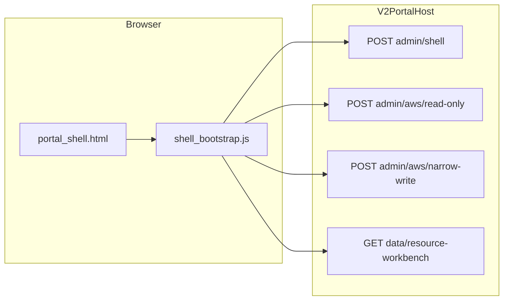

# V2 UI & AWS Domains

## PROMPT

I have two main issues:
After the cutover to V2, I want to rebuild the modular UI that adheres to the archetecture deffined by V2 documenttion and code, for interface surfaces. However, I want to rebuild the UI to have a very clean stable, style and layout recreation of the V1 portal.
see `repo/mycite-core/MyCiteV2/docs/archive/16-v2_native_portal_cutover.md`

Second, is I need you to review `repo/mycite-core/MyCiteV2/docs/ec2_awscms_admin_iam_inventory.md` to make sure that the AWS tool is properly deployed for the AWS and that the tool can be expanded to allow for me to use secondary domains for users emails of `cuyahogavalleycountrysideconservancy.org`.
Essentially, I need to create users that have the email domain of `<user>@cvccboard.org`, but I don't know if the current IAM permissions, roles, and policies are set up for this tool funcitonaility to be hardened in the V2 context for this task.

---

## PLAN

V2 portal UI parity + AWS secondary-domain hardening

---
name: V2 UI and AWS domains
overview: Rebuild the V2-native portal UI to mirror the V1 IDE-shell look while keeping shell/tool boundaries from V2 docs and state machine; then harden AWS/email operations for a secondary sender domain (@cvccboard.org) by aligning IAM reality, SES identity work, and V2 narrow-write validation (today single-domain only).
todos:
  - id: static-and-shell
    content: Add /portal/static to V2 portal host; port V1 portal.css + icons; rebuild portal.html to ide-shell layout driven by admin shell JSON
    status: pending
  - id: client-modules
    content: "Implement thin JS modules: shell bootstrap (POST admin/shell), AWS read-only/narrow-write panels, resource-workbench + health cards"
    status: pending
  - id: tests-ui
    content: "Route/architecture tests: static 200, no V1 imports, optional HTML smoke for shell classes"
    status: pending
  - id: multi-domain-contract
    content: Design allowlist field on live aws-csm profile v1; implement validation in semantic layer + live_aws_profile adapter; extend read-only payload if useful
    status: pending
  - id: tests-aws
    content: Adapter + integration tests for secondary domain accept/reject; document rollback
    status: pending
  - id: docs-iam
    content: Extend ec2_awscms_admin_iam_inventory.md with V2 status file, SES prerequisites, and explicit note that IAM path does not encode mailbox domain
    status: pending
isProject: false
---

### Context (from repo)

- **V2 cutover** ([`docs/archive/16-v2_native_portal_cutover.md`](repo/mycite-core/MyCiteV2/docs/archive/16-v2_native_portal_cutover.md)): Native host is [`instances/_shared/portal_host/app.py`](repo/mycite-core/MyCiteV2/instances/_shared/portal_host/app.py); `/portal` renders a minimal [`templates/portal.html`](repo/mycite-core/MyCiteV2/instances/_shared/portal_host/templates/portal.html). Admin capabilities are **JSON** via `POST /portal/api/v2/admin/shell` and AWS routes. Interface-surface rules are in [`docs/ontology/interface_surfaces.md`](repo/mycite-core/MyCiteV2/docs/ontology/interface_surfaces.md): the **shell owns serialized state and tool legality**; UI is not an alternate shell.
- **V1 visual system**: [`MyCiteV1/.../portal/ui/templates/base.html`](repo/mycite-core/MyCiteV1/instances/_shared/runtime/flavors/fnd/portal/ui/templates/base.html) + `/portal/static/portal.css` and icons; V1 Flask apps set `static_url_path="/portal/static"`. The V2 host **does not** currently mount `/portal/static` (only `public_dir` JSON and a few special routes in `app.py`), so a V1-looking shell requires **explicit static asset delivery** from the V2 host or nginx.
- **AWS narrow-write domain rule (critical)**: [`packages/adapters/filesystem/live_aws_profile.py`](repo/mycite-core/MyCiteV2/packages/adapters/filesystem/live_aws_profile.py) enforces `selected_verified_sender`’s domain **equals** `identity.domain`. So `user@cvccboard.org` **fails** today if `identity.domain` is `cuyahogavalleycountrysideconservancy.org`. This is **not** an IAM limitation; it is **application contract + SES identity** work. IAM path [`AWSCMSMailboxUsersPathManagement`](repo/mycite-core/MyCiteV2/docs/ec2_awscms_admin_iam_inventory.md) scopes IAM users to `user/aws-cms/smtp/*` and does not encode mailbox domain strings.

### Part A — Modular UI with V1 layout/style (architecture-safe)

**Goal:** One stable host page that **looks like V1** (menubar, activity bar, control/inspector regions, theme hook) but **hydrates navigation and tool availability** from the V2 admin shell envelope (catalog + tool registry), and renders tool panels by calling existing JSON endpoints (AWS read-only / narrow-write, resource workbench, healthz) — no new “shadow shell state” in ad-hoc JS.

Recommended structure:

1. **Static assets**
   - Add a `static/` directory under [`instances/_shared/portal_host/`](repo/mycite-core/MyCiteV2/instances/_shared/portal_host/) (or symlink strategy documented in deploy notes): copy or vendor **`portal.css`** and **`icons/`** from V1’s portal static tree so URLs stay `/portal/static/...` for nginx parity.
   - Register in Flask: `static_url_path="/portal/static"` and `static_folder=...` on `Flask(...)`, or explicit `@app.route("/portal/static/<path:...>")` — matching how V1 [`app.py`](repo/mycite-core/MyCiteV1/instances/_shared/runtime/flavors/fnd/app.py) exposes static files.

2. **Template shell**
   - Replace/extend `portal.html` with markup aligned to V1 `base.html` regions (`ide-shell`, `ide-menubar`, `ide-activitybar`, `ide-controlpanel`, workbench center). Keep **tenant/host labels** from existing template context (`tenant_id`, `host_shape`, `analytics_domain`).
   - **Data attributes** for shell composition can mirror V1 (`data-active-service`, etc.) but values should be driven from **admin shell** responses (e.g. active slice / surface id), not hard-coded V1 routes.

3. **Client module pattern (thin, catalog-driven)**
   - One small bootstrap script: `POST /portal/api/v2/admin/shell` with `requested_slice_id` from [`admin_shell.py`](repo/mycite-core/MyCiteV2/packages/state_machine/hanus_shell/admin_shell.py) constants (`admin_band0.home_status`, `admin_band0.tool_registry`, etc.).
   - Render **activity links** from `surface_catalog` + `tool_registry` entries returned in the envelope (per existing `run_admin_shell_entry` / home status surface in [`admin_runtime.py`](repo/mycite-core/MyCiteV2/instances/_shared/runtime/admin_runtime.py)).
   - Per-tool panels: modules that only call approved routes (`/portal/api/v2/admin/aws/read-only`, `narrow-write`, `GET .../resource-workbench`, `/portal/healthz`) and display JSON readably (cards/tables). No duplicate business rules in the browser.

4. **Phasing (matches cutover scope)**
   - **Phase 1:** Shell chrome + home status + AWS tools + datum workbench + health (everything already on V2 host).
   - **Phase 2+:** Additional “service” nav items only when corresponding V2 data/API surfaces exist (avoid reintroducing V1-only routes the archive marked `410`).

5. **Tests**
   - Extend [`tests/architecture/test_v2_native_portal_host_boundaries.py`](repo/mycite-core/MyCiteV2/tests/architecture/test_v2_native_portal_host_boundaries.py) or add a lightweight route test: `GET /portal/static/portal.css` returns 200; still assert **no MyCiteV1 imports** in the host module.
   - Optional: snapshot test that `GET /portal` contains key shell class names (fragile but catches regressions).

### Part B — IAM inventory review + secondary domain (@cvccboard.org)

#### What the IAM doc already supports

- [`docs/ec2_awscms_admin_iam_inventory.md`](repo/mycite-core/MyCiteV2/docs/ec2_awscms_admin_iam_inventory.md): `EC2-AWSCMS-Admin` has **AmazonSESFullAccess**, **AmazonRoute53FullAccess**, broad Lambda/S3, and **narrow IAM user management** under `arn:aws:iam::065948377733:user/aws-cms/smtp/*`. That is **adequate** for creating additional mailbox IAM users and managing SES identities/DNS **in principle**.
- The document is an **inventory**, not proof of deployment: confirm separately that the **instance profile** is attached to the EC2 (or runner) that executes AWS-CMS, and that `aws-csm` tooling uses that role.

#### Gaps for your goal (secondary board domain)

| Layer | Blocker? | Notes |
|--------|----------|--------|
| **IAM** | Unlikely | Path-scoped mailbox users; no change strictly required for a new email domain unless you want **tighter** resource scoping than `AmazonSESFullAccess`. |
| **SES** | **Required** | `cvccboard.org` must be a **verified domain or address** in SES (and DNS in Route53 if you use domain verification). |
| **V2 narrow write** | **Yes today** | Single-domain check in `FilesystemLiveAwsProfileAdapter.apply_aws_narrow_write` (see lines 91–95 in `live_aws_profile.py`). |
| **AWS-CMS profile JSON** | **Yes** | Schema `mycite.service_tool.aws_csm.profile.v1` should carry an explicit **multi-domain policy** once code supports it. |

#### Recommended default (you selected “unsure”)

**Primary domain stays `cuyahogavalleycountrysideconservancy.org` in `identity.domain`; add an explicit allowlist** on the live profile, e.g. `allowed_send_domains: ["cuyahogavalleycountrysideconservancy.org", "cvccboard.org"]` (exact key name to be chosen and documented with the aws-csm tool). Rationale: one tenant, auditable list tied to SES-verified domains, avoids maintaining duplicate full profiles per domain.

Implementation sketch:

1. **Semantic owner** (per [`read_only_and_bounded_write_patterns.md`](repo/mycite-core/MyCiteV2/docs/plans/post_mvp_rollout/post_aws_tool_platform/read_only_and_bounded_write_patterns.md)): extend validation in the module that owns allowed fields (if not already centralized, introduce a small normalizer used by the adapter) so the adapter stays thin.
2. **Adapter**: In [`live_aws_profile.py`](repo/mycite-core/MyCiteV2/packages/adapters/filesystem/live_aws_profile.py), replace strict `selected_domain == identity.domain` with: **member of** `{identity.domain} ∪ allowed_send_domains` (normalized lowercase). If allowlist absent, preserve current strict behavior for backward compatibility.
3. **Read-only surface**: Optionally expose allowed domains in the read-only payload so the UI can constrain picker/input.
4. **Tests**: Add cases in [`tests/adapters/test_filesystem_live_aws_profile_adapter.py`](repo/mycite-core/MyCiteV2/tests/adapters/test_filesystem_live_aws_profile_adapter.py) and integration tests in [`tests/integration/test_admin_aws_narrow_write_runtime.py`](repo/mycite-core/MyCiteV2/tests/integration/test_admin_aws_narrow_write_runtime.py) for accept/reject paths.
5. **Operational docs**: Update [`ec2_awscms_admin_iam_inventory.md`](repo/mycite-core/MyCiteV2/docs/ec2_awscms_admin_iam_inventory.md) with a short **“V2 portal / SES / profile contract”** section: link to `MYCITE_V2_AWS_STATUS_FILE`, note SES verification prerequisite for any new domain, and state that **IAM does not enforce email domain** — V2 + SES do.

#### Hardening note (V2 context)

- Narrow-write remains **one field**; expanding domains does not widen IAM if SES is not verified — failed sends are contained at SES.
- For stricter ops, later replace `AmazonSESFullAccess` with custom policies scoped to known identity ARNs (out of scope unless you want that pass now).

### Suggested execution order

1. Static route + V1 CSS/icons + new shell template + minimal JS wiring to admin shell + AWS/datum routes.
2. Profile allowlist + adapter + tests + aws-csm profile generation/update.
3. SES verify `cvccboard.org` + DNS + smoke narrow-write to a test mailbox.
4. IAM inventory doc appendices (deployment checklist + V2 cross-links).

---

## OUTPUT

Here is what was implemented:

### Part A — V2 portal UI (V1-style shell, V2 wiring)

- **[`instances/_shared/portal_host/app.py`](repo/mycite-core/MyCiteV2/instances/_shared/portal_host/app.py):** Flask now uses `static_folder` + `static_url_path="/portal/static"`. The catch‑all JSON route skips any `portal/…` path so static files are not shadowed.
- **Static assets:** Copied [`portal.css`](repo/mycite-core/MyCiteV2/instances/_shared/portal_host/static/portal.css) and [`portal.js`](repo/mycite-core/MyCiteV2/instances/_shared/portal_host/static/portal.js) from V1; added [`icons/logos/fnd.svg`](repo/mycite-core/MyCiteV2/instances/_shared/portal_host/static/icons/logos/fnd.svg); appended small **`.v2-*`** helpers to `portal.css`.
- **[`templates/portal.html`](repo/mycite-core/MyCiteV2/instances/_shared/portal_host/templates/portal.html):** IDE-style layout aligned with V1 `base.html` (menubar, activity bar, control panel, workbench, inspector).
- **[`static/v2_portal_shell.js`](repo/mycite-core/MyCiteV2/instances/_shared/portal_host/static/v2_portal_shell.js):** Thin client: `POST /portal/api/v2/admin/shell`, `GET /portal/healthz`, `GET …/resource-workbench`, AWS read-only / narrow-write with `tenant_scope: { scope_id: <data-tenant-id>, audience: "trusted-tenant" }`, plus inspector JSON. Reuses V1 `portal.js` for themes/splitters.

### Part B — Secondary send domains (`allowed_send_domains`)

- **Live profile JSON:** Optional top-level **`allowed_send_domains`** (list of domains). Narrow-write sender domain must be in **`identity.domain` ∪ allowed_send_domains**. Omitted list keeps the old single-domain behavior.
- **Semantic layer:** [`sender_domain_policy.py`](repo/mycite-core/MyCiteV2/packages/modules/cross_domain/aws_operational_visibility/sender_domain_policy.py) under `aws_operational_visibility`; used by [`service.py`](repo/mycite-core/MyCiteV2/packages/modules/cross_domain/aws_operational_visibility/service.py) (`allowed_send_domains` on the read-only model + normalization checks).
- **Adapter:** [`live_aws_profile.py`](repo/mycite-core/MyCiteV2/packages/adapters/filesystem/live_aws_profile.py) mirrors the same rules with **local `_…` helpers** (filesystem adapters cannot import `packages.modules` per architecture tests).
- **Admin read-only surface:** [`admin_aws_runtime.py`](repo/mycite-core/MyCiteV2/instances/_shared/runtime/admin_aws_runtime.py) passes through **`allowed_send_domains`** on the AWS read-only surface payload.

### Tests & docs

- New/updated tests: operational visibility (secondary domain), live profile adapter (CVCC-style case), native portal static + shell markup, read-only/narrow-write expectations, narrow-write error text.
- **[`docs/ec2_awscms_admin_iam_inventory.md`](repo/mycite-core/MyCiteV2/docs/ec2_awscms_admin_iam_inventory.md):** New section on V2 status file, SES verification, `allowed_send_domains`, rollback, and that IAM paths do not encode mailbox domains.

**Verification:** `125` tests passing with `PYTHONPATH=/srv/repo/mycite-core` and `/srv/venvs/fnd_portal/bin/python3`.

**Your next ops steps:** Verify `cvccboard.org` in SES, add `"allowed_send_domains": ["cvccboard.org"]` to the relevant live profile JSON, then use narrow-write (or your aws-csm tool) to set board addresses; IAM inventory as written is already sufficient for SES/mailbox IAM work—tightening is optional (e.g. replacing `AmazonSESFullAccess` with scoped policies).

---

## PROMPT:

When I visit `portal.fruitfulnetworkdevelopment.com/portal/system`, I get the blank page and message that reads:
"Not Found

The requested URL was not found on the server. If you entered the URL manually please check your spelling and try again."

---

## OUTPUT:

Here’s what was wrong and what we changed.

### Cause
The V2 native app only registered **`/portal`**, **`/portal/`**, and **`/portal/home`**. **`/portal/system`** is the old V1 “SYSTEM” URL (and what oauth2-proxy / bookmarks often use), so Flask had no rule for it and returned **404 Not Found** (blank/error page).

### Fix
1. **`app.py`** — Register **`GET /portal/system`** and serve the same shell as home via a shared `_portal_shell_page()` helper.
2. **`portal.html`** — Point the logo and OAuth links at **`/portal/system`** so they match V1-style redirects.
3. **`test_v2_native_portal_host.py`** — Assert **`GET /portal/system`** returns 200 and includes the shell assets.

After you **deploy this revision and restart** the V2 portal unit (e.g. `mycite-v2-fnd-portal.service`), `https://portal.fruitfulnetworkdevelopment.com/portal/system` should return the portal shell instead of 404.

---

## PROMPT:

There does not seem to be a recreation of the UI sheel that attaches to the core interface surfacing, or at least a recreation of the shell from the version 1 in this new paradgm.

---

## OUTPUT:

Here’s what was going wrong and what we changed.

### Why it looked “unstyled”
1. **Nginx was still sending `/portal` to the old V1 ports** (`5101` / `5203`) in [`portal.fruitfulnetworkdevelopment.com.conf`](repo/srv-infra/nginx/sites-available/portal.fruitfulnetworkdevelopment.com.conf). The V2 app with **`/portal/static/...`** lives on **`6101` / `6203`**. So the HTML could be wrong/upstream-mixed and **`portal.css` often returned 404`**, which matches a bare, default-styled page.
2. The **shell was only partially “V1-like”** without CSS: `portal.css` carries almost all of the IDE layout (activity bar, workbench, inspector, themes).

### What we fixed in-repo
1. **Nginx** (in `srv-infra`): `/portal`, `/healthz`, and the default `/` JSON proxy now target **`6101`** (FND) with **`6203`** when `portal_instance=tff`, matching the V2 cutover.
2. **Template** [`portal.html`](repo/mycite-core/MyCiteV2/instances/_shared/portal_host/templates/portal.html):
   - **`{{ url_for('static', ...) }}`** for CSS, JS, and the logo so asset URLs stay correct.
   - A **small inline “layout fallback”** so if CSS still fails, you still get a dark activity strip + basic IDE-ish layout instead of a raw HTML dump.
   - Scripts use **`defer`** and keep order: `portal.js` then `v2_portal_shell.js`.
3. **Client** [`v2_portal_shell.js`](repo/mycite-core/MyCiteV2/instances/_shared/portal_host/static/v2_portal_shell.js): the activity bar is built from **`surface_payload.available_admin_slices`** and **`available_tool_slices`** from `POST /portal/api/v2/admin/shell`, then **DATUM** is appended — aligned with “catalog-driven” shell surfacing.

### What you need to do on the server
1. **Deploy** the updated MyCiteV2 + `srv-infra` nginx snippet.
2. **`sudo nginx -t && sudo systemctl reload nginx`** so `/portal` and `/portal/static/*` hit **6101/6203**.
3. **Restart** the V2 portal units if you updated app code.

After reload, open devtools → Network: **`portal.css`** should be **200** and the full V1-style IDE chrome from `portal.css` should apply on top of the fallback layout.

---

## CONSIDERATIONS:

([Past chat][1])([Past chat][1])([Past chat][1])([Past chat][1])

1. Diagnosis

Your instruction fell short at the exact layer that determines whether V2 becomes a real modal shell or just a V1-looking page.

V2’s current architecture does not define the old portal behavior as shell-owned modal state. The repo defines the shell surface as serialized state and legality owned by `packages/state_machine`, and explicitly says a UI widget is not a shell surface and tools may not define alternate shell state . In the actual admin shell implementation, Band 0 only owns `home_status` and `tool_registry`; AWS is registered as a tool entry, not promoted to a first-class shell surface, and requesting AWS through the shell resolves as `launch_via_registry` rather than as an active shell surface . The runtime reflects that too: `run_admin_shell_entry()` only returns home or registry payloads, with tool discovery metadata, not a richer modal composition contract .

So the agent had no strong architectural instruction to recreate the V1 shell as a V2-native shell state machine. What it built instead is a V1-shaped chrome around direct route calls. The current `portal.html` has the V1-style regions visually present, but the control panel is mostly static explanatory text, the workbench is a generic title/body container, and the inspector is basically a JSON dump area . The client code confirms this: `v2_portal_shell.js` hardcodes slice IDs, builds fallback nav in JS, calls AWS and datum routes directly, and opens the inspector by dumping raw JSON into a `<pre>` . That is not the old shell recreated in the new paradigm. It is a host page styled like the old shell.

The contrast with V1 is the key. The V1 base template was not just CSS and layout. It was parameterized around service nav, activity tool links, control panel sections, foreground shell regions, inspector roots, and transient inspector mounts . Your instruction asked for “recreate the old portal styles and layout,” but the real missing requirement was “preserve the old composition semantics as shell-owned state.” Without that, the agent had room to satisfy the request cosmetically while missing the modal paradigm.

There is also a second failure mode: the archive notes overstate what is actually deployed across repos. `17-v2_ui_and_aws_domains.md` says nginx was updated so `/portal` targets V2 ports `6101` and `6203` . But the current `srv-infra` nginx config still proxies `/portal`, `/healthz`, and related traffic to `5101` and `5203` . So even if the V2 portal host code is present in `mycite-core`, the operational path still appears to point at the old upstreams. That alone can make the UI seem “failed” even when repo code changed.

The AWS portion is better specified and more real than the UI portion. The IAM inventory now correctly says IAM does not enforce sender domain, that SES verification is required, and that V2 uses `allowed_send_domains` in the live profile contract . The code for that exists both in the semantic layer and the filesystem adapter: sender domains are normalized, unioned with `identity.domain`, and narrow write rejects senders outside that allowed set  . So the AWS tool notes are not the weak point. The weak point is that the UI instruction never forced the shell/tool boundary to be re-expressed as a true V2 interaction model.

The short version of what was missing from your instruction is this: you specified visual parity, but not shell-state parity; you specified tool usage, but not composition ownership; and you treated repo changes and deployment changes as if they were one deliverable, when they are separate. The result was predictable: V1 appearance, V2 route calls, but no genuine modal shell.

The instruction needed four non-negotiable acceptance conditions. The old portal’s modal behavior had to be redefined as shell-owned serialized state, not JS-managed view state. No direct tool orchestration from the page except through a shell-defined interaction contract. The control panel, workbench, and inspector needed to be populated from V2 surface payloads with the same composition semantics V1 had. And cross-repo completion had to include nginx upstream cutover and health verification, not just template and JS edits.

If you want, I can turn this into the exact replacement prompt that would force the agent to implement the missing shell-state layer instead of just recreating the chrome.

[1]: https://chatgpt.com/c/69d55e56-79a0-8329-ba09-57bf3a3e64ca "Repository update analysis"

---